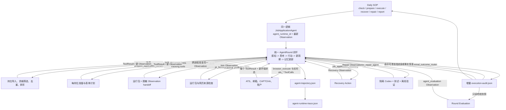
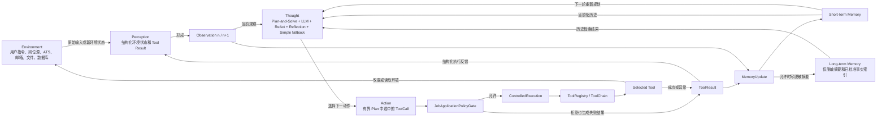

# Job Application Agent Runtime Architecture

状态：当前实现基线。每日真实投递仍以 `AGENTS.md` 和
`docs/DAILY_APPLICATION_SOP.md` 为操作入口。

## Runtime Topology

外层的 Daily SOP 只负责选择阶段目标。下面所有阶段动作都必须进入同一个逻辑
`JobApplicationAgent` 会话的 AgentRound，不能从 SOP 直接调用领域实现：



上图中的 `ROUND` 不是一个抽象标签，而是以下每次 ToolCall 都实际执行的状态机：



所以闭环的真实回边是
`ToolResult + 新 Environment State -> Perception -> Observation n+1 -> MemoryUpdate -> Thought`。
`terminal_outcome_router`、Recovery、Repair 和 Evaluation 都只是下一轮可能选择的动作或
观察来源，并不是闭环之外的后处理旁路。

每个跨阶段方框可以使用独立进程或重新建立 `AgentCore` 实例，但同一岗位以稳定
`agent_runtime_id` 和持久 Observation handoff 构成一个逻辑 Agent。进程边界不能重置语义：
准备阶段最后一个 Observation ID 必须成为执行阶段第一轮输入。日报会把不相等的情况记录为
`disconnected`，此时不能声明全流程闭环完成。Recovery、Repair 和 Evaluation 都从该岗位
轨迹的最后一个脱敏 Observation 恢复，不创建无关联的业务会话。

## Code Ownership

| 层 | 当前实现 | 职责 |
| --- | --- | --- |
| Environment adapters | `job_agent/jobs.py`, `source_config.py`, `python_runtime.py`, `chrome_runtime.py`, `gmail_verification.py` | 与岗位源、ATS、浏览器和邮箱交互 |
| Perception | `hello_agents/core/perception.py`, `job_agent/field_semantics.py`, `ats_adapters.py` | 把 JD、DOM、表单与 Tool Result 转为结构化 Observation |
| Trace / Handoff | `hello_agents/core/trace.py`, `job_agent/cli.py`, `daily_sop.py` | 脱敏序列化 AgentRound，跨进程恢复 Observation，索引阶段连续性 |
| Agent Core | `hello_agents/core/runtime.py`, `agents/job_application_agent.py`, `agents/*_agent.py` | 创建有界 Plan，选择推理策略，管理会话、ToolChain、只读并发、恢复规划和每轮考核 |
| Short-term Memory | `hello_agents/core/memory.py::ShortTermMemory` | 保存当前任务的 Observation、Tool Result 和 Policy Decision |
| Long-term Memory | `job_agent/memory.py`, `job_agent/db.py`, `profile_vector_store.py` | 查询历史申请并保存脱敏 Agent 摘要；候选人事实仍由批准档案提供 |
| Conversation Memory | `hello_agents/core/conversation.py`, `conversation_manager.py` | 管理消息历史、分支和显式 JSON 持久化；不替代候选人事实库 |
| Policy / Safety Gate | `hello_agents/career/policies.py` | 强制执行来源、事实、敏感字段、去重、终态重试、简历和提交确认策略 |
| Execution | `hello_agents/core/execution.py`, `hello_agents/tools/chain.py`, `async_executor.py`, `job_agent/execution.py` | 真实浏览器作为 `browser_execute` Tool 执行；其 Observation 必须由 `terminal_outcome_router` 消费；异步执行器只允许只读调用 |
| Tool Use | `hello_agents/tools/`, `tools/builtin/career/` | 声明参数与最高副作用，执行读取、写入或环境动作；ReAct 只能生成结构化 ToolCall |
| Evaluation | `hello_agents/career/evaluation.py`, `job_agent/daily_sop.py` | 从本轮聚合快照计算指标、阈值状态和建议，写入 Core 历史、Observation 和结构化考核文件 |
| Recovery | `hello_agents/career/recovery.py`, `job_agent/recovery_executor.py`, `job_agent/execution.py`, `daily_sop.py` | 为环境、账户、事实和结果核验阻塞生成计划，通过受控 ToolCall 执行动作，记录证据和单岗位恢复范围 |
| Repair | `job_agent/repair_orchestrator.py`, `daily_sop.py` | 从增量审计对脱敏、可修复指纹启动独立隔离 Codex，浏览器退出后才提升和 scoped retry |

`src/job_agent/` 下既有模块是领域实现和环境适配器，不为追求目录形式而搬迁。
新架构通过端口和结构化契约包住这些已验证实现，保留原有 CLI 与导入路径。

## Structured Contracts

`hello_agents/core/contracts.py` 是层间唯一数据语言：

- `Observation`：环境或 Tool Result 的结构化快照。
- `AgentLoopContext`：当前 Observation、剩余有界动作、短期记忆、Tool Result 和长期记忆
  命中的只读规划上下文。
- `AgentThought`：规划策略产生的可审计决策摘要、反思、自我批判、剩余 Plan 和选中的
  ToolCall；它不是隐藏思维链。
- `ToolCall`：Agent Core 选择的工具、参数、目的、上下文和声明副作用。
- `PolicyDecision`：允许或拒绝的代码、原因、策略来源和时间。
- `ToolResult`：工具输出、错误、真实副作用和对应策略结论。
- `MemoryUpdate`：动作后写入短期记忆的 ToolResult/Observation，以及可选的脱敏长期摘要。
- `AgentRound`：一轮完整的输入 Observation、Thought、Action、PolicyDecision、
  ToolResult、新 Observation 和 MemoryUpdate。
- `AgentLoopResult`：按顺序保存全部 AgentRound 的统一闭环结果。
- `Plan` / `AgentRunResult`：有界计划及完整执行结果。
- `StrategyRunResult`：统一四种推理策略的输出、轨迹和 Tool Result。
- `AgentEvaluationRequest` / `AgentEvaluationResult`：只读轮次快照、考核器、指标、总状态和建议。
- `RecoveryAction` / `RecoveryPlan`：恢复动作、是否需候选人、证据、冷却、重试条件和范围。
- `RecoveryActionResult` / `RecoveryExecutionResult`：每个恢复 ToolCall 的真实结果、证据、
  pending/user 状态和是否具备 scoped retry 条件。
- `AgentCoreCapabilities`：可诊断的策略、工具、考核器、恢复规划器/执行器、会话和组合执行
  能力。

工具副作用分为 `OBSERVE`、`READ`、`WRITE`、`SUBMIT` 和 `REPAIR`。执行器会取
Plan 声明与 Tool 自身声明中风险更高者，因此 LLM 或调用方不能把提交工具伪装成只读工具。

## Main Loop

1. Perception 把用户 JD、ATS 表单或 Tool Result 转为 Observation，并先写入
   Short-term Memory。
2. Agent Core 从当前 Observation、Short-term Memory 和 Long-term Memory 构建
   `AgentLoopContext`。Plan-and-Solve 给出剩余有界步骤；LLM 可在这些步骤中选择下一动作，
   但不能生成 Plan 外动作。发送给外部 LLM 的记忆投影只包含工具成功/失败/策略码和历史
   公司、岗位、状态等白名单摘要，不包含 Tool 参数、表单答案、档案值、路径或凭证。
3. Core 生成 `AgentThought`，只记录决策摘要、Reflection 和 Self-criticism。LLM
   不可用或返回无效选择时，Simple 确定性策略选择 Plan 中下一步。
4. 选中的结构化 ToolCall 作为 Action，先进入职业 Policy Gate，再由
   ControlledExecution 校验参数和调用 Tool。LLM 不能直接调用浏览器、文件或数据库。
5. Gate 拒绝时不调用 Tool，但仍返回结构化 ToolResult；Gate 允许后捕获真实输出或异常。
6. Perception 必须把该 ToolResult 转成新的 Observation，`call_id` 必须与 Action 一致。
7. Core 写入 ToolResult、新 Observation 和 `MemoryUpdate`；需要长期保存时只写脱敏轮次
   摘要，不把表单答案、档案或凭证写入运行历史。
8. 下一轮必须以上一轮的新 Observation 为输入，重新读取记忆、反思结果并选择下一动作。
   Policy 拒绝或工具失败不能被当成成功观察。
9. 两个互不依赖的运行前检查以同一父 Observation 并发执行。每个分支有独立
   AgentRound 和共同 `parallel_group_id`，显式 `concurrent_read_join` Observation 才能
   成为后续 `browser_execute` 的输入。异步入口拒绝 WRITE、SUBMIT 和 REPAIR。
10. 实时 Next 和 Submit 不是运行时直接决定后再通知 Core。Core 分别从
    `ats_advance_page / ats_stop_page_navigation` 与
    `ats_submit_application / ats_stop_before_submit` 两个候选中选择一项，只执行一轮。
    选择停止时原浏览器回调不会运行；选择执行后仍必须通过 Policy Gate。
11. 有界 Plan 完成、被策略门终止或耗尽后生成 `AgentLoopResult`。Recovery Planner 只提出
   计划，自动动作仍必须由已注册 Recovery Executor 转成 ToolCall 并通过 Gate。
12. 聚合执行轮结束后，注册的 evaluator 读取状态、manifest 和审计，返回结构化考核结果；
    Core 保存有界历史并产生 `agent_evaluation` Observation，供后续轮次规划参考。
13. CLI 进程切换时将最后 Observation 的 ID、kind、source、时间和脱敏 payload 写入
    handoff；下一阶段恢复同一个序列化 Observation。完整轨迹写入岗位
    `agent-trajectory.json`，运行级索引负责验证 ID 与 payload 连续性。

## Reasoning Strategies

- `SimpleAgent`：单轮推理，不调用 Tool。
- `PlanAndSolveAgent`：先生成有界推理步骤，再逐步求解；显式 Tool Plan 交给 Agent Core。
- `ReActAgent`：循环生成 Thought/Action，把 Action 解析为 `ToolCall` 后交给
  `ControlledExecution`，不能直接调用 `Tool.run()`。
- `ReflectionAgent`：在限定轮数内生成、评审和改进结果，不把反思文字当成环境事实。

`JobApplicationAgent.run()` 使用 `AgentCore.run_loop()` 执行一个统一状态机，不再把 review、
persistence、form 和 submit-policy 拆成彼此不可追踪的 `run_plan()` 片段。其组合策略为：

- Plan-and-Solve 保存完整有界步骤；
- ReAct 在每个 ToolResult 后重新进入 Perception 和 Thought；
- Reflection/Self-criticism 每轮检查上一动作，禁止把意图当结果；
- Simple 在 LLM 不可用、无输出或选择越界时使用 Plan 中的确定性下一步。

岗位解析、评分和表单计划等无副作用的纯计算可以在 Perception/状态投影中执行；简历目录、
数据库、文件、浏览器、API 和邮箱等环境读取或写入必须经过 ToolCall。状态中的已选简历只能
从 `resume_selector` 的 ToolResult 重建，不能为方便组装状态而在循环外再次扫描目录。

`JobApplicationAgent.create_reasoning_strategy()` 创建共享当前 LLM、Agent Core、
Policy Gate、ControlledExecution 和 ConversationManager 的策略实例。策略是可替换的推理
方式，不是四条同时执行的投递链。

`AgentCore.run_loop()` 的每个生产 Action 都通过 `ToolChain.run_calls()` 执行，因此单动作
轮次和多步 ToolChain 使用同一 Gate/Execution 语义。`AsyncToolExecutor` 已用于生产浏览器
前的 runtime package 与 resume provenance 并发检查，并叠加只读限制；`WRITE`、`SUBMIT`
和 `REPAIR` 即使被普通策略允许，也不能进入异步执行。并发结果必须 Join 后才能进入串行动作。

`AgentCore.run_strategy()`、`run_chain()`、`run_concurrent_reads()`、
`execute_recovery()` 和 `evaluate_round()` 是统一组合入口；`capabilities()` 可供诊断和
测试检查实际注册的策略、工具、考核器与恢复规划器/执行器。所有策略共享
Core 拥有的 `ConversationManager`，不会为同一次任务建立相互隔离的隐式会话。

## Agent Evaluation

`JobApplicationRoundEvaluator` 是招聘领域的每轮考核器，注册名为
`job_application_round`。它只读取聚合快照，不调用 LLM、Tool 或浏览器：

- 样本规模：本轮原始导入数与配置的 cohort 目标。
- 完整性：准备岗位是否都有终态审计，且审计是否标记 complete。
- 质量：页面确认提交数除以执行后未被安全跳过的最终合格岗位。
- 漏斗监测：原始导入到确认提交率，仅作来源质量观察。
- 不确定性：`submit_clicked_unconfirmed` 必须为 0。

Core 为每轮生成 evaluation ID、总体状态、指标和建议，保留有界内存历史，并把摘要写入
Short-term Memory。每日 SOP 将同一结果写入 `evaluation-metrics.json`，保留
`counts/rates/targets/assessment`，同时记录 `agent_core` provenance。考核是诊断反馈，
不得直接放宽资格、事实、去重、重试或提交门，也不得自行生成 ToolCall。

跨午夜执行按最新 `execution_attempt.finished_at` 的本地日期查询确认提交数；运行目录日期
只表示准备日。考核文件显式记录 accounting date、时区和 date source，避免把次日真实提交
归到前一日目标。

## Recovery Planning

环境和用户事实阻塞不等于 coding repair。`JobApplicationRecoveryPlanner` 将以下状态转成
结构化、可审计的恢复计划；`JobApplicationRecoveryExecutor` 通过 Agent Core 的
`job_application_recovery` Tool 逐项执行，并把结果写入审计、`recovery-execution.json`
和 `RUN_SUMMARY.md`：

- 反垃圾或限流：保留脱敏证据，只冷却受影响 ATS tenant，过期后先查重和只读验证。
- 支持的 CAPTCHA：配置了 CapMonster 时最多处理一次新 challenge；不支持时请求候选人交互。
- 邮箱验证：使用只读 Gmail token 查找请求之后的 code/link；未授权时请求候选人授权。
- 候选人账户：使用外部凭证存储完成登录、创建和邮箱验证；凭证不进入审计。
- 缺少候选人事实：请求候选人批准答案，更新事实源后只重建该岗位；LLM 不生成事实。
- 点击未确认：先查页面证据、门户、邮箱和 application ID；确认存在时只更新跟踪记录，
  未证明首次点击失败前不再次点击。

`retry_allowed` 只表示计划中的动作和证据全部满足后，可以考虑单岗位恢复。Policy Gate
仍要求 `recovery_verified=true` 和 `retry_scope=single_application`；原始整批重放会拒绝。

内置执行器支持 Gmail 请求后 code/link 查询、SQLite 提交结果 reconciliation、保存证据检查
和 tenant 冷却。CAPTCHA、账户或浏览器恢复依赖显式配置的外部适配器；没有适配器时返回
`pending`，候选人事实/授权返回 `waiting_for_user`，不得把计划本身误报为已执行。

`daily_sop recover --run-dir <run>` 可以为历史完整审计重新规划并执行 Recovery，而不打开
浏览器。它会覆盖审计中陈旧的计划分类并写入 `recovery-execution.json`；只有显式
`--retry-verified` 且证据齐全时才执行生成的单岗位 retry。候选人普通事实及自定义答案以
配置的 profile/`answers` 为权威源，敏感和法律答案以 approved sensitive KB 为权威源；
profile vector DB 只是派生长期检索索引。

## Repair Orchestration

执行器每完成一个岗位就原子更新审计。`daily_sop` 在浏览器子进程继续处理后续岗位时轮询该
审计，只为第一个可修复指纹启动独立隔离 repair lane。Codex 可修改和验证隔离副本，但主
工作区 promotion 必须等浏览器退出，并再次验证基线哈希；其余最终审计指纹随后去除已完成
目标并进入有界后续周期。

repair 的 attempt 编号用于不可覆盖的证据文件，逻辑 cycle 才受 `max_cycles` 限制。
Codex 认证、配置、网络或限流故障产生 `repair_unavailable`，保留 scoped request 但不消耗
cycle，也不重复同一确定性 401。`daily_sop repair` 可在环境恢复后继续隔离修复，默认不启动
浏览器；`--retry-verified` 只执行已生成且带 `repair_verified=true`、
`retry_scope=single_application` 的 batch。

恢复 retained repair 时先用当前完整审计重建 fingerprints，旧 request 只作兜底。要求
候选人原创或批准事实的字段即使原始原因是 `unmapped field` 也不会进入 repair。若当前代码
已经修复且 Codex 不产生 diff，冻结测试和离线验证全部通过后返回
`already_fixed_verified`，与已提升修复一样只能生成 scoped retry。

`daily_sop repair` 会在 Codex readiness 之前持久化上述重建结果，生成不可覆盖的
`repair-request-refresh-NN-cycle-NN.json` 并更新 state/manifest 指针。readiness 失败只
产生 `repair_unavailable`；新范围仍可审计和继续，且不会产生 repair attempt 或消耗 cycle。
`repair --refresh-request-only` 只执行这一重建和持久化步骤，不探测 Codex，也不启动修复。

readiness 使用与正式 repair 相同认证环境的只读远程 `codex exec`，而不是把
`codex login status` 当成 token 验证。脚本化调用优先使用仅注入该进程的
`CODEX_API_KEY`，并可兼容现有 `OPENAI_API_KEY`。机器级 Codex 配置选中 custom provider
时，启动器只投影 model、provider、base URL、wire API、认证模式和 `env_key` 名称，同时
继续忽略其余用户配置。provider key 只进入单次 Codex 进程；API-key/provider-env 路径使用
临时 `CODEX_HOME`，不会回退到 ChatGPT auth cache。`shell_environment_policy.inherit=none`
确保修复 Agent 启动的子 Shell 看不到该凭证。

`execute` 在完整终态审计后默认继续准备合格新候选直到达到每日目标或候选池为空；
`--one-batch` 才明确停止。缺少完整审计始终停止连续循环。

## Non-bypassable Policies

- LinkedIn 远程抓取与浏览器自动投递永远拒绝。
- `WRITE` / `SUBMIT` 不得绕过数据库重复记录或受保护终态；受保护终态只有在恢复证据已
  验证且范围是单岗位时才可重新进入执行。
- `SUBMIT` 必须由显式配置开启，并满足候选人事实、批准敏感答案、无 blocking review、
  原始 PDF 来源和页面确认证据要求。
- Tool 声明的副作用高于 Plan 声明时，以 Tool 为准。
- Evaluation 只允许读取本轮聚合事实；考核未达标不能转化为绕过筛选或安全门的配额压力。
- `REPAIR` 只接受字段/运行时可修复状态，必须使用隔离工作区、冻结测试和离线验证；
  反垃圾、CAPTCHA、邮箱验证、账户、点击未确认和站点处理错误进入 Recovery，不进入 repair。
- Repair 验证通过只能生成与指纹关联且带验证/单岗位标记的 scoped retry，不能重放原始
  整批；repair 基础设施故障不得伪装成代码修复失败或消耗逻辑周期。

## Runtime Boundary

`JobApplicationAgent` 直接继承基础 `Agent`，主流程只使用
`AgentCore.run_loop + ControlledExecution`。Simple、Plan-and-Solve、ReAct、Reflection、
ToolChain 和异步执行是当前框架能力，但所有 Tool 副作用仍由 ControlledExecution 统一调用。
CLI 命令和 `job_agent.*` 领域模块继续作为当前产品接口，不提供绕过策略门的直接执行 API。

生产浏览器批次不再由 CLI 直接启动。`job_agent.execution.execute_application_batch()` 为
每个岗位恢复 Execution Agent Core，执行只读并发 preflight，再以 `browser_execute` 持有
Python Playwright 会话。实时页面观察、填写、Next 和 Submit 由同一个 Core 临时注册为
`ats_*` Tool；每次调用均产生 Thought、PolicyDecision、ToolResult、Observation 和
MemoryUpdate。终态返回后，`terminal_outcome_router` 消费 browser ToolResult。
`evaluate_browser_execution_policy()` 仅保留为兼容性策略探针。

生成的 Node Playwright、`chrome_runtime.py` 和旧静态表单脚本仍用于离线 fixture、兼容命令
或独立诊断，不是每日 SOP 的生产投递路径，也不作为统一闭环已完成的证据。每日生产路径的
权威链是 `Policy Gate -> ControlledExecution -> browser_execute -> ats_* ToolCalls`。

## Verification

架构契约与拒绝路径由 `tests/test_agent_architecture.py` 覆盖。涉及真实投递链的任何修改还
必须运行受影响测试、完整测试和：

```bash
.venv/bin/job-agent examples verify-offline --out-dir output/offline-verify-sop
```

离线验证可以产生虚构确认结果，但不得访问真实岗位网站。
